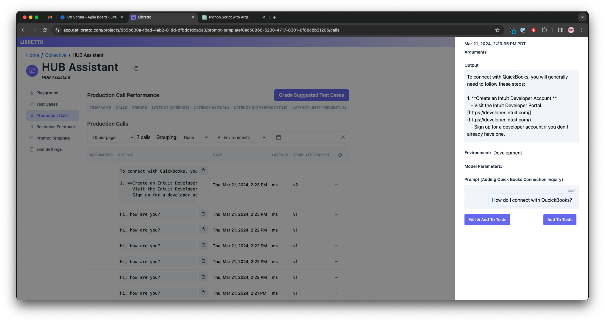

# Lobretto logging POC using openai assistants

## Introduction

This is a simple POC that has a libretto client to consume events coming from the openai assistants.

## Installation

```bash
$~ pipenv sync
```

Setup the environment variables:

```bash
$~ cp .env.example .env
```

Fill the `.env` file with the correct values.

## Usage

```bash
$~ pipenv run python main.py --help
```

```bash
$~ pipenv run python main.py --prompt "How do I connect to QuickBooks?"
```

## Screenshots


